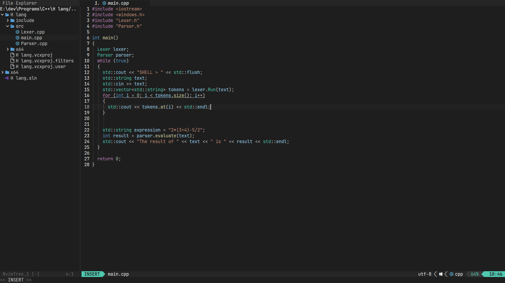
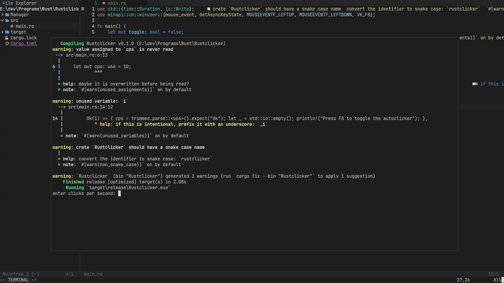

#  My neovim configuration

**This is my cool neovim configuration written in 100% lua**




**Before installing, A nerd font is required to see all the icons inside neovim.**
**the nerd font that I recommend is [JetBrainsMono](https://github.com/ryanoasis/nerd-fonts/releases/download/v3.0.2/JetBrainsMono.zip)**

**To install on windows, open command prompt and then run the command below**
```bat
rmdir /S /Q %homepath%\appdata\local\nvim-data & rmdir /S /Q %homepath%\appdata\local\nvim & git clone https://github.com/Sly-Harvey/nvim.git %homepath%\appdata\local\nvim
```

**To install on Linux/Mac, open terminal and then run the command below**
```command
rm -rf ~/.local/share/nvim && rm -rf ~/.config/nvim && git clone https://github.com/Sly-Harvey/nvim.git ~/.config/nvim
```
## After installation
open neovim and run the command :Mason
This will open the Mason menu. Here you can install lsp servers which are required for language support such as auto completions.
You can install an lsp by highlighting an lsp from the list and press "i" to install it.
For example if i program in rust then i would want to install the "rust-analyzer" lsp server.
"clangd" for C++, "Pyright" for python etc.
And if you are unsure which lsp to install, you can find the best one for the language that you use with a google search.
An extra tip if you want to uninstall an lsp you can run the command MasonUninstall (lsp name)

**Hope you enjoy my configuration.**
