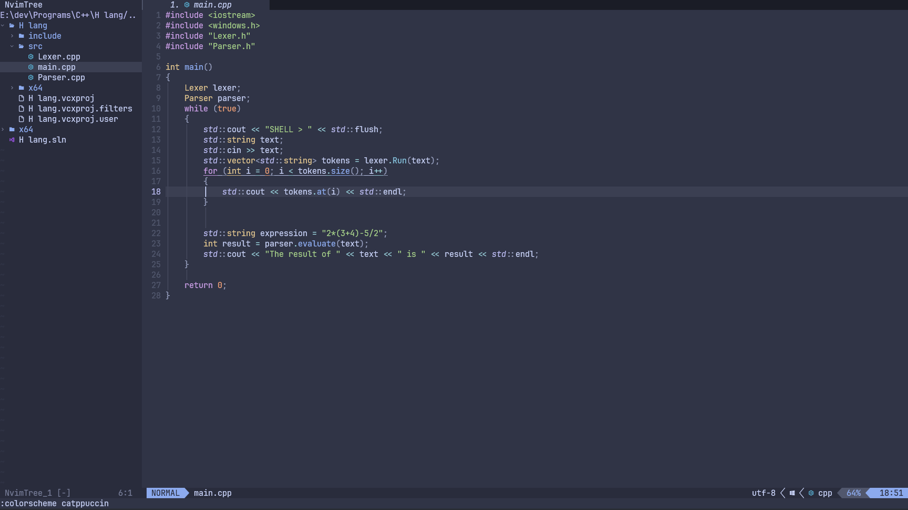
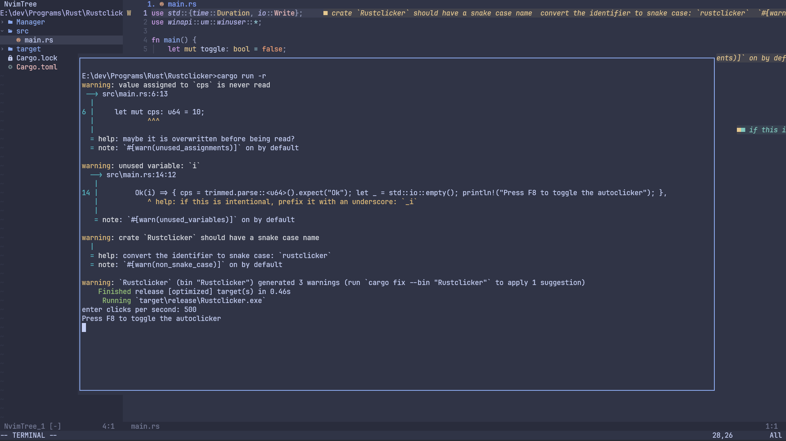

#  My neovim configuration

**This is my cool neovim configuration written in 100% lua 👌**




**Before installing, A nerd font is required to see all the symbols that neovim uses.**
**the nerd font that I recommend is [JetBrainsMono](https://github.com/ryanoasis/nerd-fonts/releases/download/v3.0.2/JetBrainsMono.zip)**

**To install on windows, open command promp and then run the command below**
```bat
mkdir %homepath%\appdata\local\nvim & rmdir /S /Q %homepath%\appdata\local\nvim && git clone https://github.com/Sly-Harvey/nvim.git %homepath%\appdata\local\nvim
```

**To install on Linux/Mac, open terminal and then run the command below**
```command
mkdir ~/.config/nvim & rm -rf ~/.config/nvim && git clone https://github.com/Sly-Harvey/nvim.git ~/.config/nvim
```

**All Keymaps can be found in lua\core\keymaps.lua**

**Now you should be set up, have fun programming :)**
